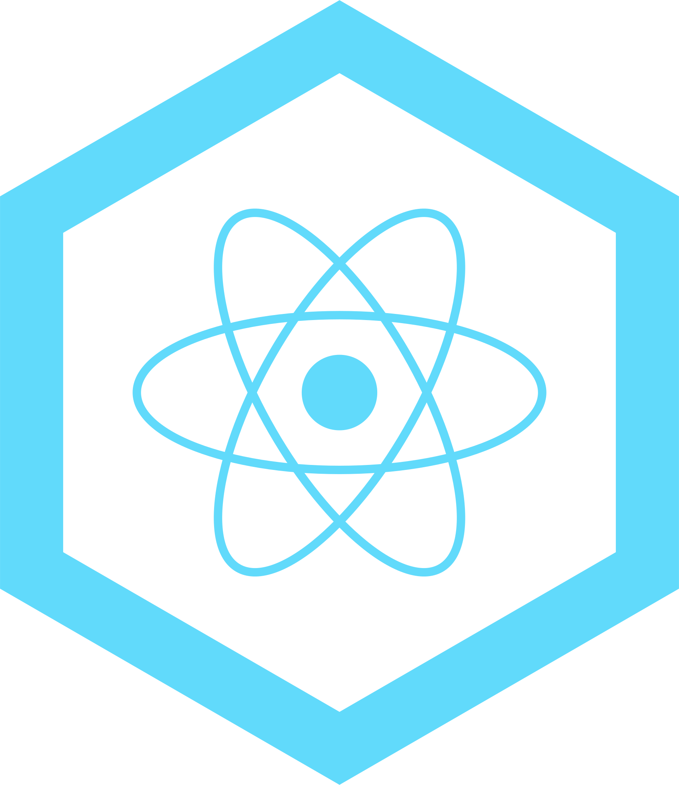

    
    <h1>Getting Started with E-constellatio's React template</h1>

## Available Scripts

In the project directory, you can run:

### `npm start`

Runs the app in the development mode.\
Open [http://localhost:3000](http://localhost:3000) to view it in the browser.

The page will reload if you make edits.\
You will also see any lint errors in the console.

### `npm test`

Launches the test runner in the interactive watch mode.\
Test will use `.env.development` file which contain all environment variables.\
See the section about [running tests](https://facebook.github.io/create-react-app/docs/running-tests) for more
information.

### `npm run build_preprod`

Builds the app for pre-production to the `build` folder.\
It will use `.env.preproduction` file which contain all pre-production environment variables.\
It correctly bundles React in pre-production mode and optimizes the build for the best performance.

The build is minified and the filenames include the hashes.\
Your app is ready to be deployed!

See the section about [deployment](https://facebook.github.io/create-react-app/docs/deployment) for more information.

### `npm run build_prod`

Like for `npm run build_preprod` this command do a build but use `.env.production` file which contain all production
variables.

### `npm run coverage`

Run tests and compute coverage of your code.

A suitable command to run while creating your tests. An alternative to `npm test` with more information like coverage of
your code by tests. Be careful `npm run coverage` is heavier and makes tests slower. Moreover, this command will run
continuously as long as you don't terminate it. This implies that the command needs its own terminal if you don't want
to run and kill it several times in a single development session.

### `npm run lint`

Run linter and tell you which lines don't respect rules. For more information about rules
see [wiki](https://github.com/Correlatio-company/react-template/wiki).

## Learn More

You can learn more in the [react-template wki](https://github.com/Correlatio-company/react-template/wiki).

To learn React, check out the [React documentation](https://reactjs.org/).
